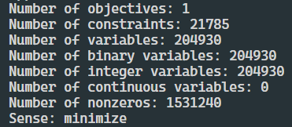
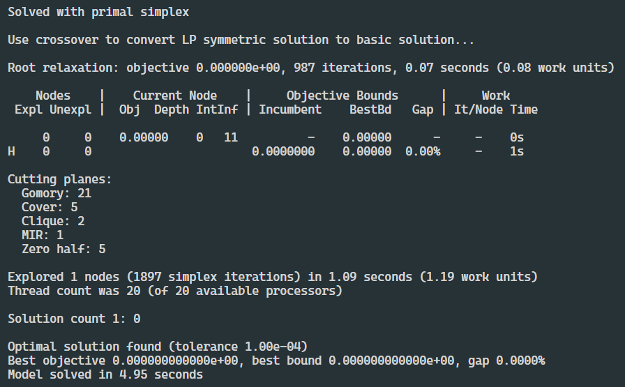

# ICAI Time Schedule Optimization

This project objective is to optimize the schedule for the Mathematical Engineering and Artificial Intelligence degree of ICAI.  Currently, this degree has 3 course years, with 5 groups in total. The first and second years have 2 groups while the third year has only one.  

To achieve this, students must attend the exact number of hours of each subject they are matriculated in and fulfil their curriculum (SHR). All the subjects cannot receive a different number of hours per week than the stipulated ones. 

Teachers need to have the capacities necessary to impart their knowledge to students (T2S). Not all teachers can impart all the classes. For example, David Alfaya can only teach Algebra and Discrete Mathematics but not Physics or Computer Vision.  

Classes must be imparted by a certain number of teachers per group (CTC). For example, an Algebra class needs only one teacher for a group while a dynamic systems laboratory or optimization class need more than one teacher.  

There are also some physical restrictions. For example, teachers cannot clone themselves (NTC ), so one teacher cannot impart more than one class at the same time. The same applies to students, who cannot attend two classes at the same time (NSD).

Although the university is available to impart classes from 8 to 12 and 15 to 21, depending on what year of study the students are in, they will only be able to have class at certain hours (EOO). First and second year students have class from 8 to 12 and third-year students from 16 to 20. So, even though the university is available for first year students to have classes during the evening, the directors have to organize the schedule so that they are imparted all their subjects during the morning hours.

Plus, there are some rules that the university has when it comes to scheduling classes. During a day, a group cannot have more than two hours of a certain subject (NSA). Furthermore, if a group has two classes of a subject on a day, these classes have to go together (NHS). They cannot be split by other subjects. For example, on a Monday, third-year students may have two hours of Optimization but these classes should go together. It is not possible to have Optimization at 4, Computer Vision at 5 and Optimization at 6 again, instead it should be Optimization at 4 and 5 and Computer Vision at 6.

The space in the university is limited. There are not enough physical laboratories in order to impart all the practical classes of certain subjects at the same time so there has to be a control of how many laboratories group needs for a subject (NCO). Each group needs a certain number of labs for a certain subject. For example, third year students need for Computer Vision 3 robotic labs.

Professors were asked about their availability to impart classes every day and every hour. The schedule should have teachers giving their classes at the days and hours they can. This parameter is binary. If it’s impossible for a teacher to impart his classes at a certain hour and day, this parameter will be a 0 and on the other hand if he is accessible, it will be a 1 (CTA). 

Although they were available, they may have personal preferences (CTP). If for a certain reason, a teacher prefers not to give a class at a certain hour of a day, well take that into account, and try to assign the teacher another hour or day, but it may be impossible to do so.

## Hard Constraints

- CTC (complete teacher capacity):
$\sum_{t} x = \text{TN}_{gs} \cdot \gamma_{gdhs} \quad \forall g,d,h,s$
 
This constraint assures that each class is given by the exact number of teachers. The gamma auxiliary variable is needed because we can either give the class or don’t, so the sum will add up to either TN or 0.

- NSD & EOO (non-subject duplication  and early or overnight):
$\sum_{s,t} x \cdot \frac{1}{\text{TN}_{gs}} = \text{A}_{gh} \quad \forall g,d,h$

This constraint assures that the group is being given only one subject at a day and hour in the groups early or overnight schedule. There are two options, if A (availability) is 0, the group will not be imparted any class and 1 forces the group to receive the subject. It is divided by TN to eliminate the repetitions created by the number of teachers. It is important to consider that when it comes to programming it has to be controlled that TN is not 0 and skip the constraint when it happens.
 
- SHR & T2S & CTA (subject hours requirement, teacher to speciality and checking teacher availability):
$\sum_{d,h,t} x \cdot \text{TS}_{st} \cdot \text{TA}_{tdh} = \text{HS}_{s} \cdot \text{TN}_{gs} \quad \forall g,s$

This constraint controls that the teacher, in an available hour and day, gives a subject which he has knowledge about. TS controls the specialty, and TA their availability. The sum has to be equal to the H (hour requirements for the subject), multiplied by the TN, which eliminates repetitions of the number of teachers. 

- NTC (no teacher clonation):
$\sum_{g,s} x \leq 1 \quad \forall d,h,t$
 
This constraint controls that a teacher is giving at most one subject to a single group in a given day and hour.
 
- TCP (teacher consistency principle):
$\sum_{d,h} x = \text{H}_{s} \cdot \zeta_{gst} \quad \forall g,s,t$

This constraint's objective is to control that a teacher gives all the classes of a subject to a group, or that he doesn’t teach them at all. This is controlled by an auxiliar variable zeta.

- NCO (no class overflow):
$\sum_{g,s,t} x \cdot \frac{\text{Q}_{cgs}}{\text{TN}_{gs}} \leq \text{L}_{c} \quad \forall c,d,h$
 
This constraint controls that there is in every moment, less class demand than L (classes available of each type of class). It is multiplied by Q, which is the number of classes that a group needs, divided by TN in order to avoid the repetition. 

- NSA (no subject abuse):
$\sum_{h,t} x \leq 2 \cdot \text{TN}_{gs} \quad \forall g,d,s$
 
This constraint controls that a subject is not given more than two hours a day for every group.

- NHS (no holes in subject):
$\sum_{t} x_{h+1} - \sum_{t} x_{h} \leq \delta'_{gdhs} \cdot \text{TN}_{gs} \quad \forall g,d,h \lt 10,s$
$\sum_{t} x_{h+1} - \sum_{t} x_{h} \geq -\delta''_{gdhs} \cdot \text{TN}_{gs} \quad \forall g,d,h \lt 10,s$
$\sum_{h}\delta'_{gdhs} + \delta''_{gdhs} \leq 2  \quad \forall g,d,s$

This constraint will control that during a day, if a subject is given twice for a group, this classes will be imparted in continued hours. It has to be counted how many positive and negative edges there are for a subject and group in a day. In order to achieve this, two types of auxiliary variables are created, one to count the positive edges ($\delta'$) and another one for the negative edges ($\delta''$).The sum of these variables has to be less than or equal to 2.

## Objective Function (Soft Constraints)

We will use the concept of soft constraints, that basically are constraints that we are allowed to break, but we will be penalized for doing so. The objective function is the following:

- CTP (checking teacher preference):
$$min_x \sum_{g,d,h,s,t} x_{gdhst} \cdot \text{TP}_{dht}$$

This penalizes the model for every teacher that is teaching in a time slot that he doesn't prefer.

## Model
The model chosen is ConcreteModel from the Pyomo Python library. This is the summary of the model:

This are the coefficient statistics of the model, that give us an idea about the numerical stability of the model:

The model takes <b>4.3</b> seconds to load.

## Results
We first tried with glpk, but it was too slow, so we ended up using Gurobi as our preferred solver. This is are the results:

We can see that the model is able to find the optimal solutio with a $0.0\%$ gap between primal and dual bounds.  
The model takes <b>4.95</b> seconds to solve.

<!-- Quotation remark -->
> This is a link with an example schedule for IMAT, and all the data used to create it: 
[Example Schedule](https://goo.gl/7Z6Z9u)
